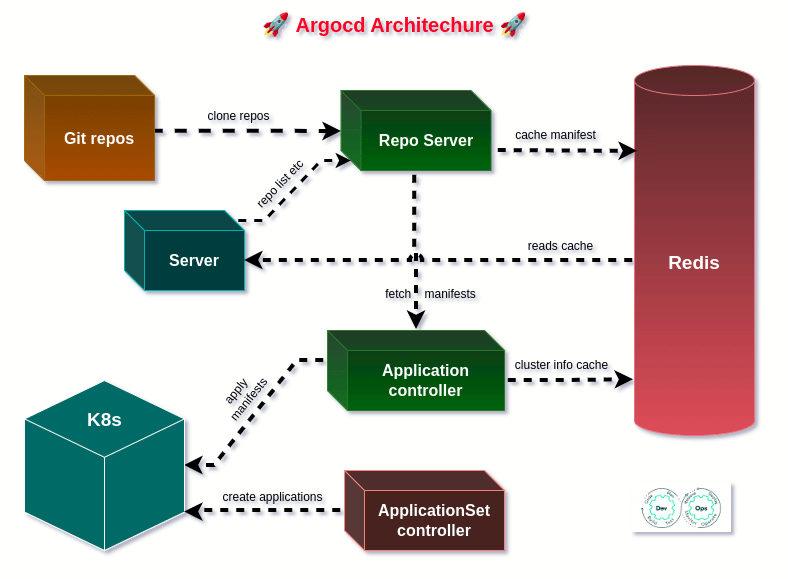
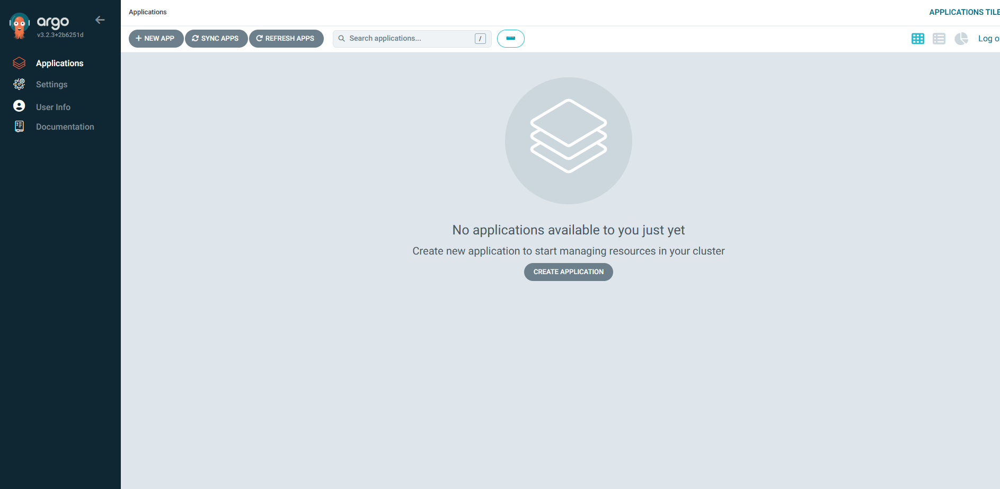
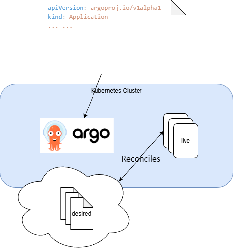
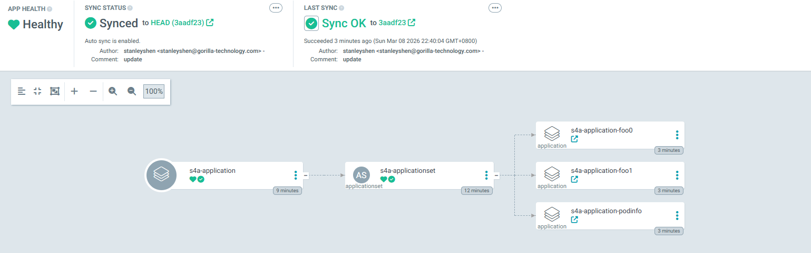
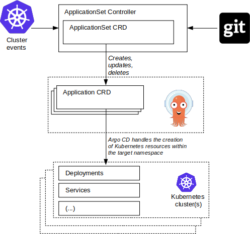
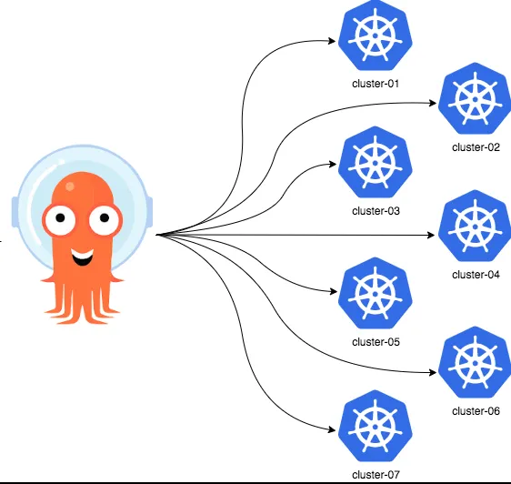

<!-- _class: lead -->

# ArgoCD Workshop

---

### ArgoCD
- Automated deployment of applications to specified target environments
- Support for multiple config management/templating tools (Kustomize, Helm, Jsonnet, plain-YAML)
- Ability to manage and deploy to multiple clusters
- SSO Integration (OIDC, OAuth2, LDAP, SAML 2.0, GitHub, GitLab, Microsoft, LinkedIn)
- Multi-tenancy and RBAC policies for authorization
- Rollback/Roll-anywhere to any application configuration committed in Git repository
- Health status analysis of application resources
- Automated configuration drift detection and visualization
- Automated or manual syncing of applications to its desired state
- Web UI which provides real-time view of application activity
- CLI for automation and CI integration
- Webhook integration (GitHub, BitBucket, GitLab)
- Access tokens for automation
- PreSync, Sync, PostSync hooks to support complex application rollouts (e.g.blue/green & canary upgrades)
- Audit trails for application events and API calls
- Prometheus metrics
- Parameter overrides for overriding helm parameters in Git

---

### ArgoCD Architecture



---

### System Requirements

- Kubernetes Cluster
- kubectl
- Helm

---

### System Requirements

> For easier access during testing, map the domain names to the workshop node IP using the local hosts file:
> {WORKSHOP_NOD_IP} argocd-workshop
> 
> {WORKSHOP_NOD_IP} argocd-workshop-s1b
> 
> {WORKSHOP_NOD_IP} argocd-workshop-s1c
> 
> {WORKSHOP_NOD_IP} argocd-workshop-s2a
> 
> {WORKSHOP_NOD_IP} argocd-workshop-s2b
> 
> {WORKSHOP_NOD_IP} argocd-workshop-s2c
> 
> {WORKSHOP_NOD_IP} argocd-workshop-s3
> 
> {WORKSHOP_NOD_IP} argocd-workshop-s4b
> 
> {WORKSHOP_NOD_IP} argocd-workshop-s4c
---

### Installing ArgoCD
> The Web UI provides a real-time view of application activity.

Install ArgoCD using make:
```bash
make install-argocd 
```

After installation, you can log in to the ArgoCD Web UI:

https://argocd-workshop

Login credentials:

- username: admin
- password: workshop



---
### ArgoCD Three CRDs

```bash
$ kubectl get crd | grep argoproj.io
applications.argoproj.io      2026-03-08T08:48:38Z
applicationsets.argoproj.io   2026-03-08T08:48:38Z
appprojects.argoproj.io       2026-03-08T08:48:38Z
```

---

### ArgoCD Application

```yaml
kind: Application
metadata:
  name: s0-application
spec:
  # The project the application belongs to.
  project: default
  source:
    # Can point to either a Helm chart repo or a git repo.
    repoURL: https://stefanprodan.github.io/podinfo
    # For Helm, this refers to the chart version.
    targetRevision: 6.10.2
    # helm specific config
    chart: podinfo
    helm:
      releaseName: s0-application
  # Destination cluster and namespace to deploy the application
  destination:
    server: "https://kubernetes.default.svc"
    namespace: gorilla
  syncPolicy:
    syncOptions:
      - CreateNamespace=true
```



---

### ArgoCD Application - Sample 1 - Helm Application

Deploy a Helm chart to the Kubernetes cluster:

```bash
$ kubectl apply -f s1a-application.yaml
application.argoproj.io/s1a-application configured
$ kubectl port-forward --address 0.0.0.0 service/s1a-application-podinfo 9898:9898 -n gorilla
Forwarding from 0.0.0.0:9898 -> 9898
```

Open: `http://192.168.4.154:9898/`

---

### ArgoCD Application - Sample 1 - Deploy with Helm Values

Apply a Helm chart with custom values:

```bash
$ kubectl apply -f s1c-application.yaml
```

Open: `http://argocd-workshop-s1c`

<table>
  <tr>
    <th>s1b-application.yaml</th>
    <th>s1c-application.yaml</th>
  </tr>
  <tr>
    <td>
<pre><code class="yaml">
kind: Application
spec:
  source:
    helm:
      parameters:
        - name: "ui.message"
          value: "ArgoCD Workshop Sample 1b"
        - name: "ingress.enabled"
          value: "true"
        - name: "ingress.className"
          value: "nginx"
        ...
</code></pre>
    </td>
    <td>
<pre><code class="yaml">
kind: Application
spec:
  source:
    helm:
      valuesObject:
        ui:
          message: "ArgoCD Workshop Sample 1c"
        ingress:
          enabled: true
          className: nginx
</code></pre>
    </td>
  </tr>
</table>

---

### ArgoCD Application - Sample 1 - Continuous Reconciliation

Try scaling the deployment manually:

```bash
$ kubectl scale --replicas=9 deployment/s1c-application-podinfo -n gorilla
```

Check events:

```bash
$ kubectl events deployment/s1-application-podinfo -n gorilla
2s Normal ScalingReplicaSet Deployment/s1a-application-podinfo Scaled up replica set s1a-application-podinfo-5757d999b9 from 1 to 9
2s Normal ScalingReplicaSet Deployment/s1a-application-podinfo Scaled down replica set s1a-application-podinfo-5757d999b9 from 9 to 1
```

You can also delete the deployment:

```bash
$ kubectl delete deployment/s1c-application-podinfo -n gorilla
deployment.apps "s1c-application-podinfo" deleted
```

ArgoCD will recreate it automatically:
```bash
$ kubectl get deployment/s1c-application-podinfo -n gorilla
NAME                     READY   UP-TO-DATE   AVAILABLE   AGE
s1a-application-podinfo   1/1     1            1           5s
```

---

### ArgoCD Application - Sample 2 - GitOps Continuous Delivery

s2-application/s2a-application.yaml
```yaml
apiVersion: argoproj.io/v1alpha1
kind: Application
spec:
  source:
    # Can point to either a Helm chart repo or a git repo.
    repoURL: https://github.com/stan1ey-shen/argocd-workshop.git
    # For Git repositories, this refers to the Git revision
    targetRevision: HEAD
    # This has no meaning for Helm charts pulled directly from a Helm repo instead of git.
    path: s2-application/podinfo
```

```
# https://github.com/stan1ey-shen/argocd-workshop.git
s2-application/
├── podinfo
│   ├── Chart.yaml
│   ├── values-prod.yaml
│   └── values.yaml
```

---

### ArgoCD Application - Sample 2 - GitOps Continuous Delivery

Deploy the Application:
```bash
$ kubectl apply -f s2-application/s2a-application.yaml 
```

Open: `http://argocd-workshop-s2a`

Now modify values.yaml:

```bash
$ nano s2-application/podinfo/values.yaml 
$ git add s2-application/podinfo/values.yaml
$ git commit -m "feat: update color"
$ git push
```

ArgoCD will automatically sync the cluster state with the Git repository.

---

### ArgoCD Application - Sample 2 - Updating Helm Values

<table>
  <tr>
    <th>s2-application/s2b-application.yaml</th>
    <th>s2-application/s2c-application.yaml</th>
  </tr>
  <tr>
    <td>
<pre><code class="yaml">
kind: Application
spec:
  source:
    repoURL: https://github.com/stan1ey-shen/...
    path: s2-application/podinfo
    helm:
      valuesObject:
        podinfo:
          ui:
            message: "ArgoCD Workshop Sample 2b"
</code></pre>
    </td>
    <td>
<pre><code class="yaml">
kind: Application
spec:
  source:
    repoURL: https://github.com/stan1ey-shen/...
    path: s2-application/podinfo
    helm:
      repoURL: https://github.com/stan1ey-shen/...
      # The path is relative to the spec.source.path
      # directory defined above
      valueFiles:
        - values-prod.yaml
</code></pre>
    </td>
  </tr>
</table>

```
# https://github.com/stan1ey-shen/argocd-workshop.git
s2-application/
├── podinfo
│   ├── Chart.yaml
│   ├── values-prod.yaml
│   └── values.yaml
```

---

### ArgoCD Application - Sample 3 - GitOps with Kustomize

```
s3-application/
├── http-echo
│   ├── deployment.yaml
│   ├── ingress.yaml
│   ├── kustomization.yaml
│   └── svc.yaml
└── s3-application.yaml
```

Deploy:
```bash
kubectl apply -f s3-application/s3-application.yaml
```

Open: `http://argocd-workshop-s3`

---

### ArgoCD Application - Tools

Argo CD supports several different ways in which Kubernetes manifests can be defined:

- Helm Charts → if Chart.yaml exists
- Kustomize → if kustomization.yaml exists
- Jsonnet → if *.jsonnet files exist
- Directory → plain YAML/JSON manifests

---

### ArgoCD ApplicationSet

> Automating the generation of Argo CD Applications with the ApplicationSet Controller

```
├── app
│   ├── foo0
│   │   └── Chart.yaml
│   ├── foo1
│   │   └── Chart.yaml
│   ├── foo2
│   │   └── Chart.yaml
│   ├── foo3
│   │   └── Chart.yaml
│   ├── foo4
│   │   └── Chart.yaml
│   ├── foo5
│   │   └── Chart.yaml
│   └── podinfo
│       └── Chart.yaml
├── foo0-application.yaml
├── foo1-application.yaml
├── foo2-application.yaml
├── foo3-application.yaml
├── foo4-application.yaml
├── foo5-application.yaml
└── podinfo-application.yaml
```

---

### ArgoCD ApplicationSet - App of apps

```yaml
apiVersion: argoproj.io/v1alpha1
kind: Application
metadata:
  name: s4a-application
spec:
  source:
    # Can point to either a Helm chart repo or a git repo.
    repoURL: https://github.com/stan1ey-shen/argocd-workshop.git
    # For Helm, this refers to the chart version.
    targetRevision: HEAD
    # This has no meaning for Helm charts pulled directly from a Helm repo instead of git.
    path: s4-application/s4a-appsets
```



---

### ArgoCD ApplicationSet - List Generator

```yaml
# kubectl apply -f s4-application/s4a-application.yaml 

apiVersion: argoproj.io/v1alpha1
kind: ApplicationSet
spec:
  goTemplate: true
  goTemplateOptions: ["missingkey=error"]
  generators:
    - list:
        elements:
          - appname: foo0
          - appname: foo1
          - appname: podinfo
  template:
    metadata:
      name: "s4b-application-{{.appname}}"
      labels:
        app: infra
    spec:
      # The project the application belongs to.
      project: "default"
      # Source of the application manifests
      source:
        repoURL: https://github.com/stan1ey-shen/argocd-workshop.git
        targetRevision: HEAD
        path: "s4-application/app/{{.appname}}"
...
```

---

### ArgoCD ApplicationSet - Git Generator

```yaml
# kubectl apply -f s4-application/s4b-application.yaml 
 
apiVersion: argoproj.io/v1alpha1
kind: ApplicationSet
spec:
  goTemplate: true
  goTemplateOptions: ["missingkey=error"]
  generators:
    - git:
        repoURL: https://github.com/stan1ey-shen/argocd-workshop.git
        revision: HEAD
        directories:
          - path: s4-application/app/*
  template:
    metadata:
      name: "s4b-application-{{index .path.segments 2}}"
      labels:
        app: infra
    spec:
      # The project the application belongs to.
      project: "default"
      # Source of the application manifests
      source:
        repoURL: https://github.com/stan1ey-shen/argocd-workshop.git
        targetRevision: HEAD
        path: "{{.path.path}}"
      destination:
        name: in-cluster
        namespace: "gorilla-{{index .path.segments 2}}"
...
```

---

### ArgoCD ApplicationSet

<table>
  <tr>
    <th>Without ApplicationSet:</th>
    <th>With ApplicationSet</th>
  </tr>
  <tr>
    <td>
<pre><code class="yaml">

```
├── app
│   ├── foo0
│   │   └── Chart.yaml
│   ├── foo1
│   │   └── Chart.yaml
│   ├── foo2
│   │   └── Chart.yaml
│   ├── foo3
│   │   └── Chart.yaml
│   ├── foo4
│   │   └── Chart.yaml
│   ├── foo5
│   │   └── Chart.yaml
│   └── podinfo
│       └── Chart.yaml
├── foo0-application.yaml
├── foo1-application.yaml
├── foo2-application.yaml
├── foo3-application.yaml
├── foo4-application.yaml
├── foo5-application.yaml
└── podinfo-application.yaml
```
</code></pre>
    </td>
    <td>
<pre><code class="yaml">
├── app
│   ├── foo0
│   │   └── Chart.yaml
│   ├── foo1
│   │   └── Chart.yaml
│   ├── foo2
│   │   └── Chart.yaml
│   ├── foo3
│   │   └── Chart.yaml
│   ├── foo4
│   │   └── Chart.yaml
│   ├── foo5
│   │   └── Chart.yaml
│   └── podinfo
│       └── Chart.yaml
├── s4b-application.yaml
└── s4b-appsets
    └── s4b-applicationset.yaml
</code></pre>
    </td>
  </tr>
</table>

---

### ArgoCD ApplicationSet



---

### ArgoCD Projcet - Default

```yaml
apiVersion: argoproj.io/v1alpha1
kind: AppProject
metadata:
  creationTimestamp: "2026-03-08T08:48:40Z"
  generation: 1
  name: default
  namespace: infra-argocd
  resourceVersion: "1240"
  uid: 5b45b637-fe2f-4125-b558-eaab6c077ba3
spec:
  clusterResourceWhitelist:
  - group: '*'
    kind: '*'
  destinations:
  - namespace: '*'
    server: '*'
  sourceRepos:
  - '*'
status: {}
```

---

##  ArgoCD Project

```yaml
apiVersion: argoproj.io/v1alpha1
kind: AppProject
metadata:
  name: my-project
  namespace: argocd
spec:
  # Project description
  description: Example Project

  # Allow manifests to deploy from any Git repos
  sourceRepos:
  - '*'

  # Only permit applications to deploy to the 'guestbook' namespace or any namespace starting with 'guestbook-' in the same cluster
  # Destination clusters can be identified by 'server', 'name', or both.
  destinations:
  # Destinations also allow wildcard globbing
  - namespace: guestbook-*
    server: https://kubernetes.default.svc
    name: in-cluster

  # Deny all cluster-scoped resources from being created, except for Namespace
  clusterResourceWhitelist:
  - group: ''
    kind: Namespace
    # Name is optional. If specified, only resources with a matching name will be allowed.
    # Globs in Go's filepath.Match syntax are supported. Example: "team1-*".
    name: ''

  # Deny all Namespace resources from being created if their name starts with 'kube-'
  clusterResourceBlacklist:
    - group: ''
      kind: Namespace
      # Name is optional. If specified, only resources with a matching name will be denied.
      name: 'kube-*'

  # Allow all namespaced-scoped resources to be created, except for ResourceQuota, LimitRange, NetworkPolicy
  namespaceResourceBlacklist:
  - group: ''
    kind: ResourceQuota

  # Deny all namespaced-scoped resources from being created, except for Deployment and StatefulSet
  namespaceResourceWhitelist:
  - group: 'apps'
    kind: Deployment

  # Enables namespace orphaned resource monitoring.
  orphanedResources:
    warn: false

  roles:
  # A role which provides read-only access to all applications in the project
  - name: read-only
    description: Read-only privileges to my-project
    policies:
    - p, proj:my-project:read-only, applications, get, my-project/*, allow
    groups:
    - my-oidc-group

  # Sync windows restrict when Applications may be synced. https://argo-cd.readthedocs.io/en/stable/user-guide/sync_windows/
  syncWindows:
  - kind: allow
    schedule: '10 1 * * *'
    duration: 1h
    applications:
      - '*-prod'
    manualSync: true

# By default, apps may sync to any cluster specified under the `destinations` field, even if they are not
  # scoped to this project. Set the following field to `true` to restrict apps in this cluster to only clusters
  # scoped to this project.
  permitOnlyProjectScopedClusters: false

  # When using Applications-in-any-namespace, this field determines which namespaces this AppProject permits
  # Applications to reside in. Details: https://argo-cd.readthedocs.io/en/stable/operator-manual/app-any-namespace/
  sourceNamespaces:
  - "argocd-apps-*"
```

---

### ArgoCD Declarative GitOps CD for Kubernetes

```yaml
# Git repositories configure Argo CD with (optional).
apiVersion: v1
kind: Secret
metadata:
  labels:
    argocd.argoproj.io/secret-type: repository
...
```

```yaml
apiVersion: v1
kind: Secret
metadata:
  name: mycluster-secret
  labels:
    argocd.argoproj.io/secret-type: cluster
```

---

### ArgoCD - Managing Multi-Cluster


